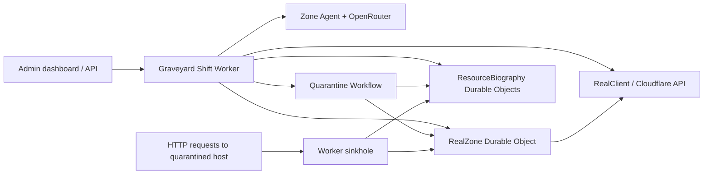

# Graveyard Shift

The Worker ranks suspect DNS records, stores per-record biographies in SQLite-backed Durable Objects, routes chat through a zone-scoped Cloudflare Agent and OpenRouter, and runs quarantines through a Workflow. Mock mode is tested end to end. Real Cloudflare mode has a guarded implementation and fake-API tests; it has not been connected to a live zone.

## Run locally

1. `npm install`
2. Copy `.dev.vars.example` to `.dev.vars` and set a long random `ADMIN_SECRET` and your `OPENROUTER_API_KEY`. Wrangler can also load an ignored `.env` file with `--env-file .env`.
3. `npm run dev` and open `http://localhost:8787/`. Sign in with `ADMIN_SECRET` to use the dashboard.
4. `curl -H 'x-admin-secret: YOUR_SECRET' http://localhost:8787/api/suspects`
5. `curl -H 'x-admin-secret: YOUR_SECRET' http://localhost:8787/api/biography/mock-1`
6. `curl -N -X POST -H 'x-admin-secret: YOUR_SECRET' -H 'content-type: application/json' -d '{"message":"Why does old-api.example.test exist, can I kill it?"}' http://localhost:8787/api/chat`

`GET /api/chat/history` returns the latest 40 messages. The `/api/chat` response uses Server-Sent Events. The Agent obtains and validates a complete OpenRouter JSON response before sending answer chunks, so the first chunk waits for the model call. The dashboard consumes this endpoint without exposing the OpenRouter key to the browser.

`npm test` runs scoring, eligibility, Durable Object, endpoint, Workflow, sinkhole, and model-adapter tests in the Cloudflare Workers runtime. Tests replace the OpenRouter key with an empty value and never call the live provider. `npm run typecheck` checks TypeScript. The Workers test runner must be allowed to bind localhost.

## Mock quarantine demo

`DRY_RUN=true` is the default. To let **only the mock zone** change, run `npx wrangler dev --local --env-file .env --var DRY_RUN:false`.

1. `POST /api/quarantine/propose` with `{"recordId":"mock-1","quarantineSeconds":5,"screamThreshold":1}`. The response contains a short-lived, one-time confirmation token and the original record.
2. Show the plan to the administrator. Only after their explicit confirmation, `POST /api/quarantine/confirm` with the same fields plus `"token":"..."`. The server binds the token to the record, window, threshold, and unchanged record snapshot. Under the default dry run, confirmation reports the intended route and changes nothing.
3. `GET /api/quarantine/status/mock-1` returns the Workflow status, countdown deadline, biography, and hit log.
4. In mock mode, `POST /api/dev/simulate-scream` with `{"recordId":"mock-1","ip":"198.51.100.50","userAgent":"Browser/1","path":"/app","country":"US"}`. This endpoint requires the admin secret. A request to a quarantined mock hostname also reaches the sinkhole and receives HTTP 503.
5. `POST /api/quarantine/resurrect` with `{"recordId":"mock-1"}` requests restoration during quarantine. The same endpoint restores a deleted mock record from its saved snapshot after the Workflow completes.

All `/api/` endpoints require `x-admin-secret` or a signed, HttpOnly, SameSite=Strict dashboard session. Browser mutations require JSON and a matching Origin when it is present. The sinkhole hostname route is public by design. Bot user agents are logged but do not count as screams. Repeated hits from the same IP hash and user agent count once. The IP is stored as an HMAC hash; the raw address is not stored. Each zone accepts at most three simultaneous quarantines. Windows are limited to 1–120 seconds in mock mode to make the demo fast. Real mode accepts 1 hour to 14 days.

`MockZone` is a third SQLite-backed Durable Object, one per zone. It persists the fake DNS records, routes, reservations, and hashed confirmation tokens so separate Worker requests see the same state. This replaces the brief's purely in-memory fake zone while keeping the `MockClient` interface. `ResourceBiography` stores the full pre-change snapshot, hit log, events, score, and lifecycle state. Workflow steps are retriable; the zone and biography transitions are idempotent. The Workflow state is coordination data, not the source of biography history.

The sinkhole only sees HTTP(S) requests routed through the Worker. It cannot detect mail, SSH, direct-IP access, cached DNS use, or other non-web traffic. A quiet window therefore does **not** prove a record is unused.

## Obituaries and gallery

The dashboard lists suspects, evidence, chat, a confirmation plan, the quarantine countdown, a restore button, and obituary cards. Each obituary card can restore its deleted record from the saved snapshot, subject to the current dry-run setting and conflict checks. `GET /api/graveyard` lists deleted records from the mock set of 12 biography Durable Objects or the real zone index.

After deletion, a separate retriable Workflow step builds an obituary from the saved biography and remaining zone records, then stores it in `ResourceBiography`. This keeps the page available after completed Workflow state expires. `GET /obituary/:id` is public and server renders escaped HTML with Open Graph tags. Resurrection removes the obsolete obituary. Born is the DNS `created_on` timestamp. Died is the deletion event time. Cause is the quarantine duration and counted unique screams. Survivors are remaining records with the same exact target. Last words are the last logged sinkhole request path, country, and reason; they are not a claim about the record's purpose.

OpenRouter selects the opening, one recorded fact, and closing for a one-line epitaph using strict JSON output. The Worker assembles only those vetted fragments, so model output cannot introduce an unsupported claim. If the free model is unavailable, the Worker writes a factual fallback and marks `epitaphSource: fallback`; the obituary still publishes. A milestone-4 request returned HTTP 429, verifying the fallback. After switching to `openrouter/free` and increasing the completion budget, a live mock deletion produced an epitaph with `epitaphSource: openrouter`.

The static dashboard assets run through the Worker first so it can check the session before serving them. The public obituary page bypasses that session check. The gallery is private because it is an administrative view. The `ADMIN_SECRET` stays server side. Local sessions last 12 hours. Use HTTPS for any non-local deployment so the Secure cookie flag is set.

## How scoring works

`MockClient` seeds 12 DNS records in `example.test`. `listSuspects` excludes the apex, unsupported types, protected names, and names outside the zone before scoring. It awards 45 points for a failed target resolution check, 20 for at least 180 days since modification, 20 for a reported zero traffic count, and 15 for a suspicious hostname token. Each signal carries its evidence. A missing check returns `null` and contributes no points. A score is a review priority, never permission to delete.

The mock's target and traffic checks are seeded facts, not live DNS or analytics measurements. Mock dates use a fixed September 29, 2026 seed so repeated reads do not invent modifications. `PROTECTED_NAMES` is a comma-separated list of full hostnames or relative names, and defaults to `www,mail,api`. `DRY_RUN` defaults to `true`; it blocks all mock DNS and route mutations until explicitly disabled for a local demo.

## Real Cloudflare mode

`CF_MODE=real` uses `RealClient` for Cloudflare DNS and Worker Routes API calls. It reads at most 20 pages of 100 records and refuses a full 20th page to avoid a truncated review, checks at most 25 CNAME targets through DNS-over-HTTPS, and returns `unknown` for unavailable traffic data. It does not infer zero traffic from missing analytics. The zone name is checked against Cloudflare before a proposal or confirmation. Real quarantines accept eligible, unproxied A, AAAA, and CNAME records only; apex, protected names, and pre-existing Worker routes are rejected. This deliberately leaves already-proxied records for manual review.

`RealZone` stores one-time confirmation hashes, unchanged snapshots, route IDs, reservations, and the graveyard index. On apply, it attaches the Worker route before switching DNS to a proxied placeholder (`192.0.2.0` for A, `100::` for AAAA, and `sinkhole.invalid` for CNAME). The A and AAAA values follow Cloudflare's originless-record guidance; the CNAME choice needs live validation. It rechecks the route and record before mutation. If apply fails, the Workflow attempts to restore the snapshot. Counted HTTP screams trigger immediate restoration; the Workflow also checks every 30 minutes and restores on an administrator request. It deletes only if the record still matches the quarantine placeholder. Restoring after deletion recreates the record with a **new Cloudflare record ID**. If a conflicting record appears, recovery stops for manual review instead of overwriting it. API failures can still leave partial state; inspect the Worker route, DNS record, `RealZone`, and biography before retrying an errored Workflow.

### Setup and deployment

1. Keep `DRY_RUN` set to `true`. Create a Cloudflare API token scoped to one zone with Zone Read, DNS Read/Edit, and Workers Routes Read/Edit. Keep that runtime token separate from the credentials Wrangler uses to deploy the Worker.
2. Set `CF_MODE=real`, `CF_ZONE_ID` (32-character zone ID), `CF_ZONE_NAME` (zone apex), and `SINKHOLE_SCRIPT_NAME` (the deployed Worker script name, currently `graveyard-shift`) in the `vars` section of `wrangler.jsonc`. Do not put `CF_API_TOKEN`, `ADMIN_SECRET`, or `OPENROUTER_API_KEY` in `vars` or Git.
3. Configure those three secrets for the deployed Worker through Cloudflare's dashboard or Wrangler. `npx wrangler secret put NAME` **deploys a new version immediately**; review the configuration before using it. Local development can use ignored `.dev.vars` or `.env` instead.
4. Run `npm test`, `npm run typecheck`, and `npx wrangler deploy --dry-run`. Deploy the reviewed Worker, then use `/api/suspects` and a dry-run proposal/confirmation to verify the zone and route plan. The Worker needs to be deployed before any hostname route is attached.
5. Only after a live dry-run review, set `DRY_RUN=false` and deploy that configuration. A real proposal uses a 1-hour minimum and still requires a separate one-time confirmation. Never test the write path on a production hostname without its owner present.

The dashboard in real mode uses a 1-hour default proposal. The API accepts windows up to 14 days. `DRY_RUN=true` blocks writes in both `RealZone` and `RealClient`; it leaves DNS and routes untouched. The real mutation path has fake-API state-machine coverage, but no live Cloudflare API call, route propagation, DNS resolution, or browser visual check has been performed. See [DEMO_SCRIPT.md](DEMO_SCRIPT.md) for the two-minute mock walkthrough.

On the Workers Free plan, Workflows allow 1,024 steps and retain completed state for three days. A 30-minute real check interval keeps a 14-day quarantine below that step limit; long-lived biography and obituary data stay in Durable Objects. Worker subrequests are limited, so the real client caps pagination and DNS-over-HTTPS checks. The brief's Workers AI component is replaced by OpenRouter per your instruction.

## Provider and assignment deviation

The latest instruction chooses OpenRouter for biography summaries and chat. `OPENROUTER_MODEL` defaults to `openrouter/free`; only `:free` models or `openrouter/free` are accepted, and `OPENROUTER_API_KEY` stays in a Worker secret. The free router selects one compatible free model per request; it does not run every free model. A live local chat returned schema-valid evidence after the completion budget rose to 3,000 tokens; an earlier 1,200-token response contained reasoning but no final content. Free model selection, availability, and rate limits can change. This provider choice changes the brief's Workers AI requirement; if the assignment strictly requires Workers AI, OpenRouter alone may not satisfy that rubric. DNS record names, targets, scores, and signal evidence are sent to OpenRouter. The adapter requests strict structured JSON, validates it locally, rejects unknown evidence kinds, and always reports the record's purpose as `unknown`. The final answer is assembled from stored facts, so model text cannot authorize a DNS action.

`GraveyardAgent` persists conversation history per zone. The first biography observation is logged once; later changed metadata produces a `modified` event. Neither the chat agent nor the model has a DNS write capability.

## Milestones

- **1:** Mock records, eligibility checks, scored suspects, tests. Implemented locally.
- **2:** SQLite-backed biography Durable Object, zone agent chat, OpenRouter adapter and schema validation. Implemented locally; the supplied key passed one end-to-end local chat test.
- **3:** Sinkhole, quarantine Workflow, confirmation tokens, recovery, state-machine tests. Implemented in mock mode; resurrection, deletion, post-deletion recovery, three-slot limit, and default dry run were verified locally.
- **4:** Persistent obituaries, public Open Graph page, private static dashboard and gallery. Implemented locally in mock mode; a live free-model epitaph was rate limited and used the factual fallback.
- **5:** Real Cloudflare client, guarded route and DNS Workflow, deployment setup, and demo script. Implemented locally with fake-API tests; no live Cloudflare zone or deployment was available for validation.

No Cloudflare deployment or live DNS API integration has been tested. The live OpenRouter chat test used mock DNS facts and your locally supplied key. A live real-zone rehearsal is required before enabling writes. The current chat endpoint explains records; chat tools for quarantine and obituary lookup have not yet been added, so those actions use explicit API routes and dashboard controls.

### Deployment status and handoff

The local environment has no authenticated Cloudflare account. A temporary preview deployment was considered, but deployment with `--secrets-file .env` was rejected by automatic approval review because it would upload the OpenRouter key and admin secret to an unclaimed account. No Worker or secrets were uploaded. Cloudflare's temporary accounts also document Durable Objects but not Workflows as a supported temporary-account resource, so a temporary preview cannot be treated as a verified full demo. For a lasting deployment, sign in with `npx wrangler login` in this project directory, review `wrangler.jsonc`, and deploy to your own account with secrets configured as described above. Keep `CF_MODE=mock` and `DRY_RUN=true` for the first deployment. Switching to real mode requires your zone identifiers and zone-scoped API token; this project has not been authorized for a particular live zone.

## Documentation consulted

- [Cloudflare Agents API](https://developers.cloudflare.com/agents/runtime/agents-api/)
- [Workflows step and sleep API](https://developers.cloudflare.com/workflows/build/workers-api/)
- [SQLite-backed Durable Object storage](https://developers.cloudflare.com/durable-objects/api/sqlite-storage-api/)
- [Workers AI model catalog](https://developers.cloudflare.com/workers-ai/models/) and [JSON mode](https://developers.cloudflare.com/workers-ai/features/json-mode/)
- [DNS records API](https://developers.cloudflare.com/api/resources/dns/subresources/records/)
- [Workers routes API](https://developers.cloudflare.com/api/resources/workers/subresources/routes/)
- [GraphQL Analytics plan limits](https://developers.cloudflare.com/analytics/graphql-api/limits/)
- [OpenRouter structured outputs](https://openrouter.ai/docs/guides/features/structured-outputs/) and [free router](https://openrouter.ai/openrouter/free/apps)
- [Current Cloudflare Vitest plugin](https://developers.cloudflare.com/workers/testing/vitest-integration/)
- [Workers static assets binding and worker-first routing](https://developers.cloudflare.com/workers/static-assets/binding/)
- [Originless DNS placeholder guidance](https://developers.cloudflare.com/dns/manage-dns-records/how-to/create-dns-records/)
- [Workflow Free plan limits](https://developers.cloudflare.com/workflows/reference/limits/)
